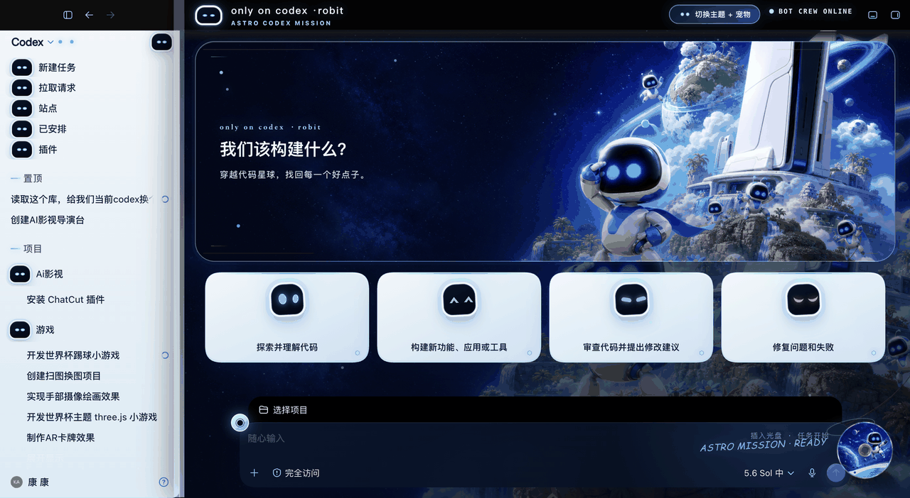

# AI Desktop Dream Skins

English · [中文](README.md)

A complete desktop-theme workflow for Codex, Tencent WorkBuddy, and TRAE Work. This repository contains platform-specific Skills, CSS, packaged base themes, event-driven relaunch recovery, and real UI screenshots—not just wallpapers.

## Included base themes

| Platform | Base theme | Included | Relaunch recovery |
| --- | --- | --- | --- |
| Codex | ps-codex-5 | Full UI, independent decorations, four expressions, DualSense pet | Codex session guard |
| WorkBuddy | ns-workbuddy-2 | Measured hero, cartridge, Joy-Con, home and conversation CSS | Event-driven, hot recovery first |
| TRAE Work / TRAE SOLO | trae-xbox-cn | X/S artwork, black-green UI, home and chat coverage, readable editor | Event-driven, hot recovery first |

### Codex · ps-codex-5




### WorkBuddy · ns-workbuddy-2


### TRAE · trae-xbox-cn


## Install the Skills

Run on macOS:

```bash
./scripts/install-skills-macos.sh
```

Existing Skills are backed up under `~/.codex/skill-backups/` before the five bundled components are installed. Installation does not force-close running apps. See the [English startup guide](docs/STARTUP-GUIDE.en.md) for activation and recovery commands.

## Every-launch notes

1. Open the app normally from Dock or Finder and wait; do not click the icon repeatedly.
2. If WorkBuddy or TRAE starts without its debugging endpoint, the guard may perform exactly one recovery restart.
3. Finish artwork, CSS, and packaging before any restart. Reserve restart testing for final acceptance.
4. Run `./scripts/check-installation-macos.sh` before reinstalling when a theme is missing.
5. Run the platform `persist` command whenever the active package path changes.
6. Save unsent input before a manually authorized recovery restart.

## Repository layout

```text
skills/       Platform Skills, router, and pet pipeline
themes/       Three installable base themes
screenshots/  Home, conversation, and readability evidence
docs/         Bilingual startup and recovery guides
scripts/      Installer and read-only diagnostics
```

## Compatibility principles

- Each platform keeps its own dimensions, DOM contract, port, manifest, and package format.
- A complete theme covers both the landing page and real project conversations.
- Decorative layers must be pointer-inert, and text contrast must be checked at live size.
- The persistence guard reacts to launch events; it does not poll and never reopens an app after the user quits.

## Acknowledgements

Special thanks to the following original projects and open-source work for their foundations, inspiration, and compatibility references:

- [Fei-Away/Codex-Dream-Skin](https://github.com/Fei-Away/Codex-Dream-Skin): the original Codex Dream Skin project and theme-engine foundation.
- [captainfod/TRAE-Work-Dream-Skin](https://github.com/captainfod/TRAE-Work-Dream-Skin): the foundation for TRAE Work theme adaptation.
- [openai/skills · hatch-pet](https://github.com/openai/skills/tree/main/skills/.curated/hatch-pet): the reference workflow and format for Codex desktop pets.

Thanks to the original authors and all contributors. This repository builds on their work with separate platform contracts, persistent recovery, full-interface adaptation, and bundled base themes for all three applications.

## Notice

This is an unofficial, fan-made local theming toolkit. Product names and marks including Codex, ASTRO BOT, PlayStation, Nintendo Switch, Xbox, TRAE, and WorkBuddy belong to their respective owners. Original theme artwork in this repository does not imply endorsement or official authorization. Users are responsible for applicable terms and redistribution rights.

Base-theme platform mapping: `ps-codex-5` is the **PS5** theme, `ns-workbuddy-2` is the **NS2** theme, and `trae-xbox-cn` is the **XSX/S** theme.
